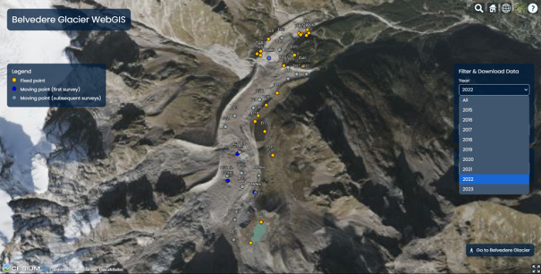

# Belvedere WebGIS

Code for the Django-based WebGIS for the Belvedere Glacier monitoring project. The development of this platform is part of the students capacity building initiative of the Belvedere Glacier Summer School yearly organised by the Department of Civil and Environmental Engineering of Politecnico di Milan (Italy).

The platform aims at becoming an operational tool for the exploration and visualisation of the in situ campaign for the collection of GNSS measurements of targets as well as for orthophotos and digital surface models resulting from the photogrammetric processing of drone images.

Built on top of free and open source technologies, the project was possible thanks to the adoption of the following libraries and tools:

* [**PostgreSQL**](https://www.postgresql.org/) + [**PostGIS**](https://postgis.net/)
* [**Django**](https://github.com/django/django)
* [**Cesium JS**](https://github.com/CesiumGS/cesium)
* [**Plotly.js**](https://github.com/plotly/plotly.js)
* [**jsPDF**](https://github.com/parallax/jsPDF)

[...]

Documentation in progress!

[...]

Based on the thesis work of Elisa Bianchi, MSc Student in Environmental and Land Planning Engineering at Politecnico di Milano. The project was carried out under the supervision of Federica Gaspari and Prof. Federica Migliaccio.

## Contacts
- Federica Gaspari (federica.gaspari@polimi.it) - [tars4815](https://github.com/Tars4815)

## See Also

To learn more about the summer school students capacity building initiative:

- Gaspari, F., Ioli, F., Barbieri, F., Bonora, S., Fascia, R., Pinto, L., Migliaccio, F. (2024) **[Bridging geomatics theory to real-world applications in alpine surveys through an innovative summer school teaching program](https://doi.org/10.5194/isprs-archives-XLVIII-4-W12-2024-59-2024)**, *Int. Arch. Photogramm. Remote Sens. Spatial Inf. Sci.*, XLVIII-4/W12-2024, 59–66.

[...]
